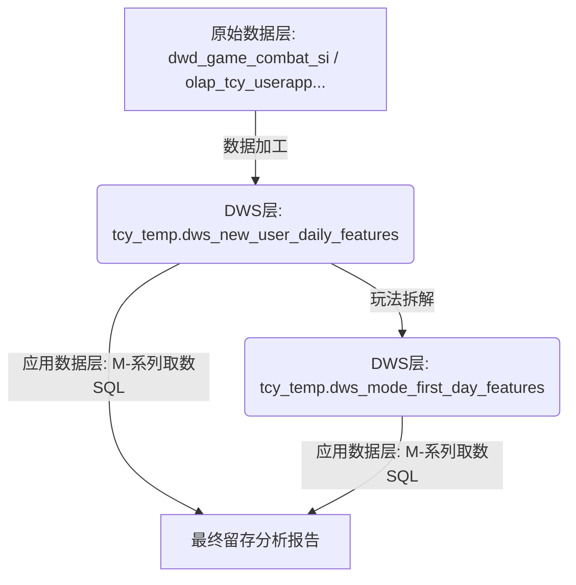

# 斗地主新增用户留存分析：DWS中间层架构方案

> 为适配 StarRocks 执行性能要求，将复杂的原始表宽查询拆解为 DWS 层中间表架构。本方案设计了两级中间表结构，核心原则是"计算下沉、查询上报"。

## 一、架构设计总览



---

## 二、DWS 中间层构建方案

### 2.1 核心事实表 (DWS Level 1)
**表名**: `tcy_temp.dws_new_user_daily_features`
**粒度**: `uid` (每日新增用户事实)

构建逻辑：
- 沉淀用户的渠道分类 (官方/渠道/小游戏)
- 沉淀用户的登录分端 (group_id: PC/APP/小游戏)
- 计算用户的首日核心经济与对局指标

```sql
CREATE TABLE tcy_temp.dws_new_user_daily_features AS
SELECT 
    reg.uid,
    reg.reg_date AS reg_date,
    login.first_channel_id AS channel_id,
    chn.channel_category_name AS channel_category,
    login.first_group_id AS group_id,
    -- 核心特征汇总 ... (包含win_rate, game_count, diff_money 等)
FROM tcy_temp.dws_dq_daily_reg reg
LEFT JOIN tcy_temp.dws_dq_daily_login login 
    ON reg.uid = login.uid 
    AND CAST(DATE_FORMAT(login.login_date, '%Y%m%d') AS INT) = reg.reg_date
LEFT JOIN tcy_temp.dws_channel_category_map chn ON login.first_channel_id = chn.channel_id
-- ... 关联 combat 事实表进行聚合 ...
```

### 2.2 玩法扩展表 (DWS Level 2)
**表名**: `tcy_temp.dws_mode_first_day_features`
**粒度**: `uid` × `game_mode`

构建逻辑：
- 在 Level 1 基础上，按玩法维度进行对局聚合。
- 引入玩法映射逻辑 (经典/不洗牌/癞子)。

---

## 三、后续行动步骤

1.  **准备环境**：确认 `tcy_temp.dws_channel_category_map` 维度表数据正常。
2.  **创建 DWS 层**：按照方案执行上述两张 DWS 表的构建 (SQL 待落地)。
3.  **重构分析 SQL**：修改 `docs/` 下的两个文档，将原本复杂的 `WITH` 子句全部改为直接扫描两张 DWS 表，实现秒级响应。

---

> **下一步**：我将开始执行各个文档的 SQL 重构工作，您无需手动修改，我会通过工具批量更新。

> **更新**：所有 DWS 表已优化，详见各表文档 v1.1 版本。主分析文档更新至 v3.1，分玩法文档更新至 v2.1。
