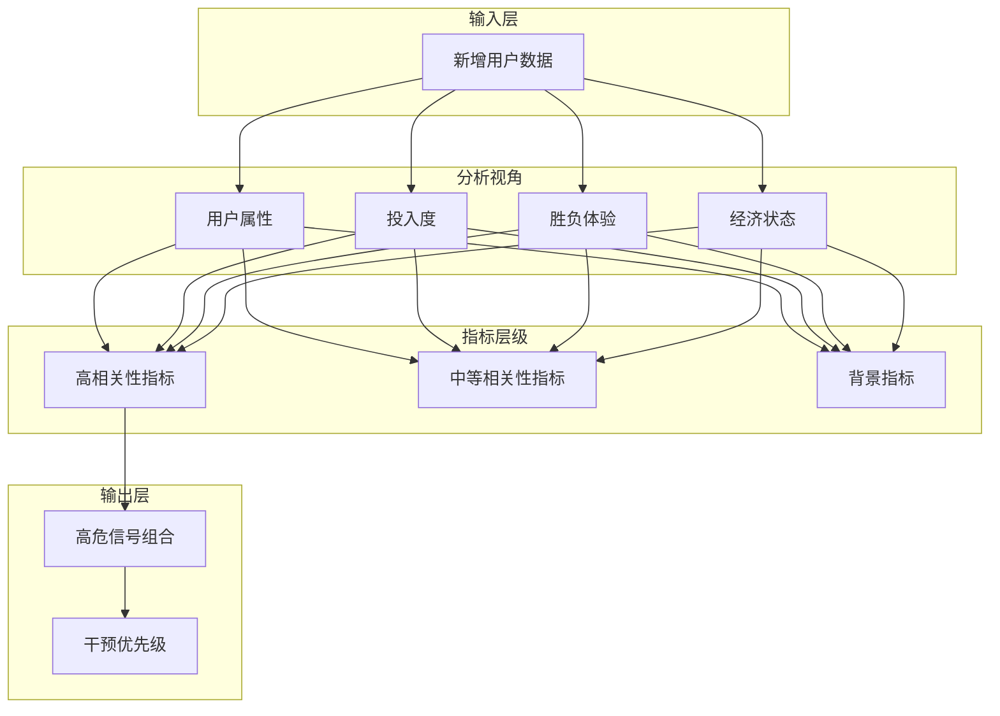
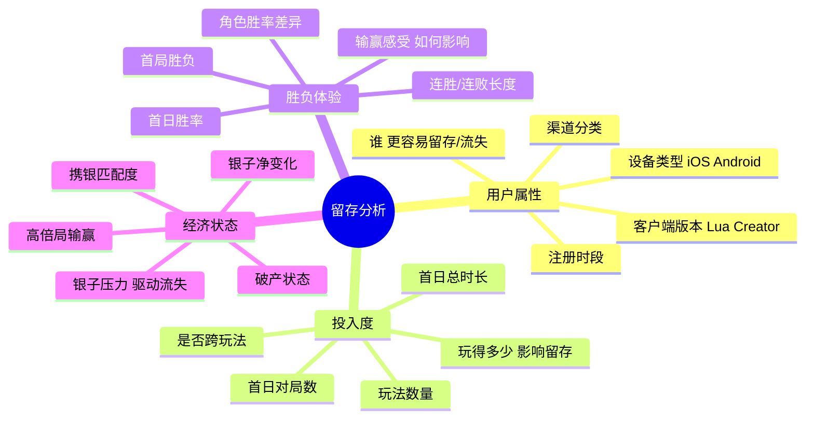
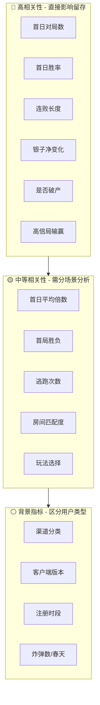
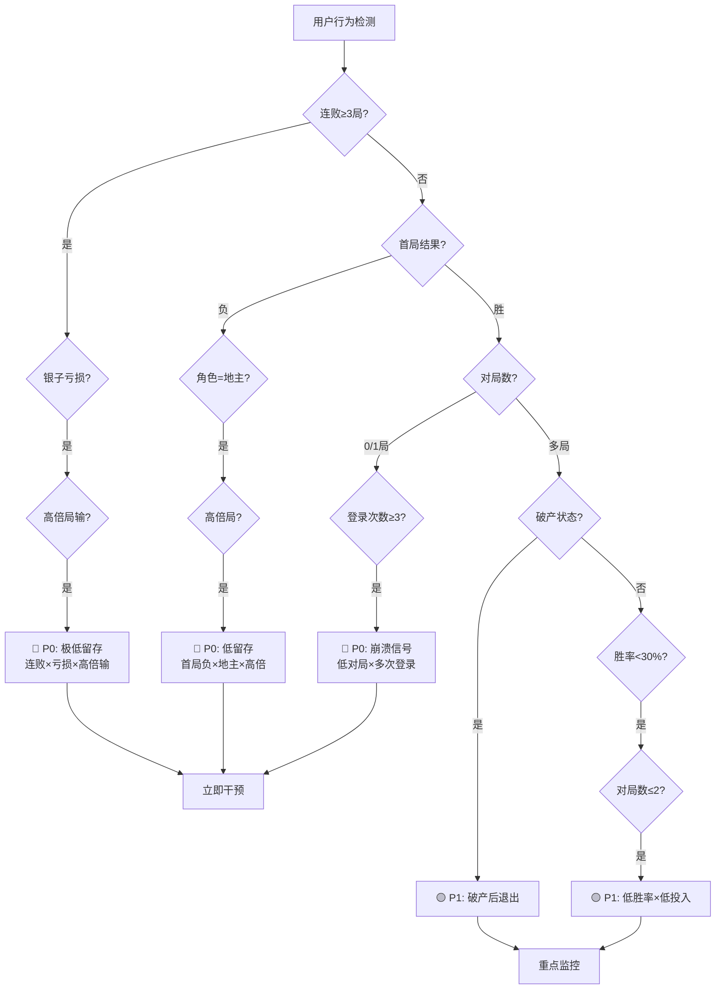
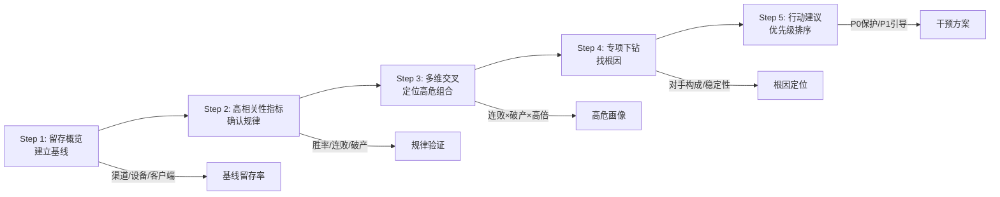
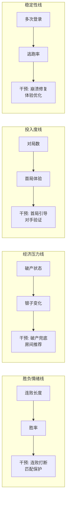
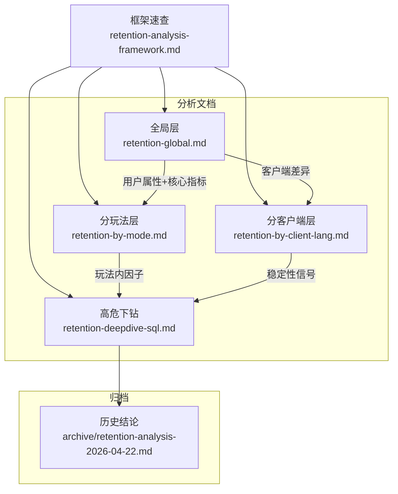

# 留存分析框架：视角与相关指标

> 本文档提炼留存分析的核心视角、关键指标及其与留存的相关性规律，作为后续分析的速查手册。

---

## 框架概览



---

## 一、分析视角（四大维度）



| 视角 | 核心问题 | 分析子维度 |
| ---- | ---- | ---- |
| **用户属性** | "谁"更容易留存/流失？ | 渠道分类、设备类型（iOS/Android）、客户端版本（Cocos-Lua/Cocos-Creator）、注册时段 |
| **投入度** | "玩得多少"影响留存？ | 首日对局数、首日总时长、玩法数量、是否跨玩法 |
| **胜负体验** | "输赢感受"如何影响留存？ | 首日胜率、连胜/连败长度、首局胜负、角色胜率差异（地主/农民） |
| **经济状态** | "银子压力"是否驱动流失？ | 银子净变化、破产状态、高倍局输赢、携银与房间匹配度 |

---

## 二、留存相关指标（影响力金字塔）



### 2.1 高相关性指标（直接影响留存）

| 指标 | 分组方式 | 留存规律（已验证） |
| ---- | ---- | ---- |
| **首日对局数** | 0局/1局/2-5局/6-10局/10+局 | 存在最优区间（6-10局），过少未形成习惯，过多可能疲劳 |
| **首日胜率** | <30%/30-50%/50-70%/70%+ | 胜率<30%流失风险极高，胜率与留存正相关 |
| **连败长度** | 0-1/2-3/4-5/5+ | 连败≥3局流失概率急剧上升，关键流失预警信号 |
| **银子净变化** | 巨亏(<-5万)/大亏(-5万~-1万)/小亏(-1万~0)/小赚(0~1万)/大赚(1万~5万)/巨赚(>5万) | 净亏损用户留存显著低于盈利用户 |
| **是否破产** | 银子谷值≤最低房间门槛 | 破产后直接退出比例高，经济系统兜底的核心指标 |
| **高倍局输赢** | 仅赢高倍/仅输高倍/有赢有输 | 输高倍（>24x）是流失高危信号，赢高倍留存提升 |

### 2.2 中等相关性指标（需分场景分析）

| 指标 | 分组方式 | 留存规律 |
| ---- | ---- | ---- |
| **首日平均倍数** | ≤6/6-12/12-24/24+ | 倒U型关系，12-24x留存最优（非越高越好） |
| **首局胜负** | 胜/负 | 首局胜率预期偏高（新手配牌），首局负留存显著低 |
| **逃跑次数** | 0/1/2/3+ | 逃跑反映挫败感，逃跑率>15%留存极低 |
| **房间匹配度** | 携银/房间门槛比值 | 比值<3（携银刚够门槛）风险高，易被快速淘汰 |
| **玩法选择** | 单玩法/多玩法 | 多玩法探索用户留存更高（兴趣广） |

### 2.3 弱相关性/背景指标（区分用户类型）

| 指标 | 作用 |
| ---- | ---- |
| **渠道分类** | 区分渠道质量，非产品问题 |
| **客户端版本** | 识别稳定性差异（多次登录=崩溃信号） |
| **注册时段** | 区分用户画像（夜间玩家/白天玩家），时段本身无因果 |
| **炸弹数、春天发生率** | 游戏体验细节，需分玩法看（癞子天然高倍） |

---

## 三、流失高危信号组合



| 组合特征 | 留存预期 | 优先级 |
| ---- | ---- | ---- |
| **连败≥3 + 银子亏损 + 高倍局输** | 极低（<10%） | P0 |
| **首局负 + 地主角色 + 高倍局** | 低（<15%） | P0 |
| **0局/1局 + 多次登录（≥3）** | 低（崩溃/掉线） | P0 |
| **破产 + 不再对局** | 极低 | P1 |
| **胜率<30% + 对局数少（≤2）** | 低 | P1 |

---

## 四、分析路径建议



```text
Step 1: 留存概览 → 建立基线（渠道/设备/客户端分组留存）
  ↓
Step 2: 高相关性指标分组 → 确认规律（胜率/连败/破产/高倍局）
  ↓
Step 3: 多维交叉 → 定位高危组合（连败×破产×高倍输）
  ↓
Step 4: 专项下钻 → 找根因（1局用户对手构成/客户端稳定性）
  ↓
Step 5: 行动建议 → 优先级排序（P0保护机制/P1引导优化）
```

---

## 五、核心结论：影响留存的四条主线



| 主线 | 核心指标 | 产品干预方向 |
| ---- | ---- | ---- |
| **胜负情绪线** | 连败长度、胜率 | 连败打断机制、匹配保护、新手配牌优化 |
| **经济压力线** | 破产状态、银子净变化 | 破产兜底、房间智能推荐、倍数上限限制 |
| **投入度线** | 首日对局数、首局体验 | 首局引导强化、新手礼包加厚、首局对手构成验证 |
| **稳定性线** | 多次登录、逃跑率 | 客户端崩溃修复、操作体验优化、逃跑罚没调整 |

---

## 六、文档结构关系



| 文档 | 分析粒度 | 留存判定 |
| ---- | ---- | ---- |
| [retention-global.md](retention-global.md) | 全局层（全体新增用户） | 登录表判定 |
| [retention-by-mode.md](retention-by-mode.md) | 分玩法层（经典/不洗牌/癞子） | 对局表判定 |
| [retention-by-client-lang.md](retention-by-client-lang.md) | 分客户端层（Cocos-Lua/Creator） | 登录表判定 |
| [retention-deepdive-sql.md](retention-deepdive-sql.md) | 三大问题下钻 SQL | 专项问题诊断 |

> **历史结论报告**：已备份至 [archive/retention-analysis-2026-04-22.md](archive/retention-analysis-2026-04-22.md)
