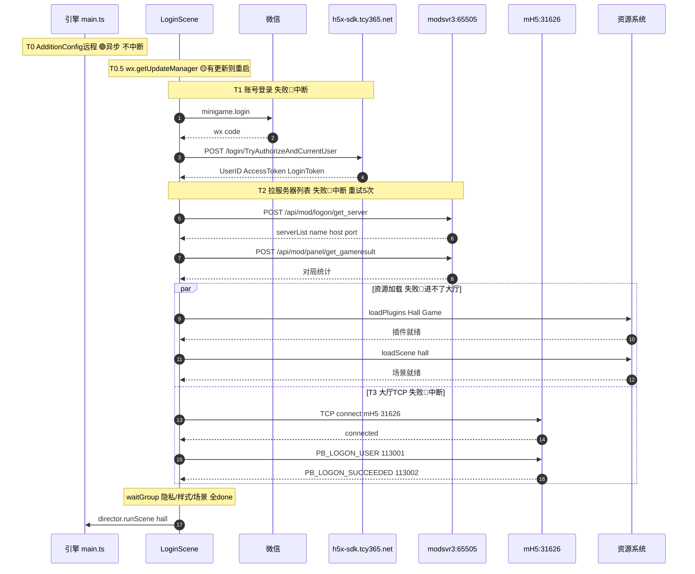

# 登录链路 API 时序与故障影响（cocos-client/login-api-sequence.md）

> 登录链路的**完整 API 地址** × **调用时序** × **故障影响分级**，用于上线核对与排障。
> 流程详解见 `login-flow.md`；域名/协议号全表见 `startup-flow.md`。本文聚焦「调了什么 API、什么顺序、哪一步断了会登录失败」。
>
> 故障级别：🔴 致命（登录中断/进不了大厅）｜🟡 条件（可重试/自动降级/用户选择）｜🟢 安全（异步/后台/不影响登录）
>
> **环境**：以正式 `serverMode=0` 为准；测试环境见 §5。

## 1. 完整时序图（标注中断点）



## 2. API 时序总表（按调用先后，正式环境）

| 序 | 环节 | 完整 API | 方法 | 故障 |
|----|------|---------|------|------|
| T0 | 框架初始化（登录前） | `https://rusysappconfigapi.tcy365.com/api/AppConfig/getuploadconfig?AppCode=zgde&ChannelId={cid}&SubChannelId={cid}&VersionNo={ver}&ConfigVersion={v}&ConfigType=2&UsageType=1` | GET | 🟢 |
| T0.5 | 资源更新（登录前） | `wx.getUpdateManager().onCheckForUpdate()` | 平台 API | 🟡 |
| **T1a** | 登录① 拿 code | `wx.login()` → `minigame.login` | 平台 API | 🔴 |
| **T1b** | 登录① SDK 登录 | `https://h5x-sdk.tcy365.net/login/TryAuthorizeAndCurrentUser` | POST JSON | 🔴 |
| T1c | 登录① 内容安全（首次） | `https://h5x-sdk.tcy365.net/Third/CheckMsgSecAuthAccessToken` | POST JSON | 🟢 |
| **T2a** | 登录② 拉服务器列表 | `https://modsvr3.youxi8848.com:65505/api/mod(logon)/get_server` | POST protobuf | 🔴 |
| **T2b** | 登录② 拉对局统计 | `https://modsvr3.youxi8848.com:65505/api/mod(panel)/get_gameresult` | POST protobuf | 🟡 |
| **T3a** | 登录③ 大厅 TCP 连接 | `mH5.youxi8848.com:31626`（TCP） | TCP | 🔴 |
| **T3b** | 登录③ 大厅登录 | TCP `PB_LOGON_USER=113001`（`HallPB.LogOnUser`）→ `PB_LOGON_SUCCEEDED=113002` | TCP | 🔴 |
| T3c | 大厅心跳 | TCP `MR_REQUEST_PULSE=30003`（60s） | TCP | 🟡 |
| T4a | 进大厅后·公告 | `https://activitynoticesysapi.tcy365.net/api/RollNews/getList?GameCode=&GroupId=&GameId=&ChannelId=&VersionNo=&UserTypeId=&AppChannelId=` | GET | 🟢 |
| T4b | 进大厅后·微信解密 | `https://miniprogagency.tcy365.net/api/Weixin/DecodeEncryptedData` | POST JSON | 🟢 |
| T4c-h | 进大厅后·其他业务 | `huodong/exchangemall/generalactivity/emailawardapi/payopenapi` 各 API | — | 🟢 |
| T4.5a | 远程图片列表 | `https://mbyx.youxi8848.com/{module}/config.json` | GET | 🟢 |
| T4.5b | 远程图片 | `https://mbyx.youxi8848.com/{imagePath}` | GET | 🟢 |
| T4.6 | 分享图 | `https://h5game.youxi8848.com/H5/zgde/WechatGame/share/{image}` | GET | 🟢 |
| T5a | 进桌·游戏服 | TCP `{room.szGameIP}:{nGamePort+20000}` → `MR_CHECK_VERSION=300002` → `GR_ENTER_GAME=200110` | TCP | 🟢 |
| T5b | 进桌·兜底 | TCP `publicmpsvr.youxi8848.com:31700`（响应无 svrs 时） | TCP | 🟢 |

> 资源加载分支（loadPlugins/loadScene hall）不在表内（非网络 API），但其失败 🔴 进不了大厅，见 §3。

## 3. 故障影响分级详解

### 🔴 致命中断点（任一失败 → 登录中断 / 进不了大厅）

| 故障点 | 后果 | 代码处理 | 位置 |
|--------|------|---------|------|
| **T1a** `minigame.login` 拿不到 code | 账号登录失败，弹窗 | `kLoginFail` 回调 → `Action_UserLogin` FAILURE | `wx/index.ts:125` |
| **T1b** SDK `TryAuthorizeAndCurrentUser` 失败 | 账号登录失败，弹"账号登录失败【msg】" | 同上 | `wx/index.ts:254` |
| **T2a** `get_server` 重试 5 次仍失败 | 拉不到服务器列表，登录中断 | `login(count)` 超 `MAX_TRY_COUNT` → `b3.FAILURE` | `action_getserver.ts:48` |
| **T3a** 大厅 TCP `connect` 失败 | 大厅连接失败，登录中断 | `onHallConnectError` → `b3.FAILURE` | `action_loginhall.ts:80` |
| **T3b** `PB_LOGON_USER` 响应非 SUCCEEDED（且非 GR_NEED_LOGON） | 大厅登录失败 | `status = FAILURE` + 弹窗 | `action_loginhall.ts:310` |
| **资源** `bundle.loadScene('hall')` 失败 | 进不了大厅，弹"请重新打开游戏" → restart/exit | `showModel` + `minigame.restart()` | `loginscene.ts:521` |

> 这 6 个点是**登录链路的硬依赖**，排障优先查。共同特征：T1b→T2a→T3a→T3b 是严格串行，前者产物是后者输入。

### 🟡 条件/降级（失败可重试或自动回退，不直接中断）

| 故障点 | 降级行为 | 位置 |
|--------|---------|------|
| T0.5 热更新检测到更新 | 弹窗让用户确认 → `applyUpdate()` 重启（用户不点可继续） | `loginscene.ts:256` |
| T1 快速登录失败 | 自动回退全新登录 `wx_login(false)` | `wx/index.ts:99` |
| T2 缓存登录服失效 | 清 `LogonAddress_{mode}` 缓存 → 换默认登录服重试 | `action_getserver.ts:116` |
| T2b `get_gameresult` 失败 | `getGameBout` 失败 → `status=FAILURE`（但不影响主登录，快速登录时跳过） | `action_getserver.ts:145` |
| T3b 响应 `GR_NEED_LOGON` | 快速登录场景回退重新 `Action_UserLogin` 再试 | `action_loginhall.ts:292` |
| T3c 心跳超时（3 次） | 大厅场景自动 `checkNetworkStatus` 重连；游戏中不重连大厅 | `HallSocket.ts:53` |
| 隐私政策未同意 | 不启动 `startLogin`，等用户同意（非错误，是前置门） | `loginscene.ts:274` |
| 大厅断线（`onHallDisconnected`） | `Action_CheckNetStatus` 检测 + 重连 | `hallcenter.ts:1740` |

### 🟢 安全（异步/后台/登录后，不影响登录链路）

| 点 | 为何不影响登录 |
|----|--------------|
| T0 AdditionConfig 远程 `reqLatestConfig` | 异步触发，本地默认配置（`AdditionConfig.json`）已兜底，`main.ts` 不 await |
| T1c `CheckMsgSecAuthAccessToken` | 首次登录的合规补充，失败仅 log |
| T4a-h 业务域名（公告/活动/邮件/商城/支付） | 进大厅后才触发，登录早已完成 |
| T4.5 远程图片 / T4.6 分享图 | 按需加载，失败仅个别图不显示 |
| T5 进桌（游戏服） | 登录已完成；进桌失败回大厅，不中断登录 |

## 4. 致命中断点速查（排障清单）

登录失败时，按此顺序排查（串行依赖，逐级后移）：

```
微信能拿到 code 吗?           T1a  wx.login
   ↓ 是
SDK 登录通吗?                 T1b  h5x-sdk.tcy365.net  ← 查这个域名白名单/可达性
   ↓ 通
服务器列表拉到了吗?           T2a  modsvr3.youxi8848.com:65505  ← 查这个域名
   ↓ 拉到
大厅 TCP 连得上吗?            T3a  mH5.youxi8848.com:31626  ← 查这个地址
   ↓ 连上
PB_LOGON_USER 返回 SUCCEEDED? T3b  大厅登录响应
   ↓ 成功
大厅场景资源加载成功?         资源  bundle.loadScene('hall')
   ↓ 成功
→ 进大厅
```

**常见根因**：
- 微信小游戏「合法域名白名单」漏配 → T1b/T2a/T4 被微信拦截（`request:fail url not in domain list`）
- `serverMode` 配错（正式包用了 Test 域名 / 测试包用了 Formal）→ 全链路错位
- `192.168.1.26`/`192.168.1.125` 等内网地址未替换 → 正式包 T2a 连内网失败
- `mH5.youxi8848.com:31626` 防火墙/端口未放行 → T3a TCP 连接失败

## 5. 测试 / 正式环境对照

| 用途 | 正式（`serverMode=0`） | 测试（`serverMode=2` ← 当前） |
|------|----------------------|------------------------------|
| 远程配置 | `https://rusysappconfigapi.tcy365.com` | `http://rusysappconfigapi.tcy365.org:1505` |
| 微信 SDK | `https://h5x-sdk.tcy365.net` | `https://testdemosdk.tcy365.net` |
| 登录服 LV | `https://modsvr3.youxi8848.com:65505` | `http://192.168.1.125:65505` |
| 大厅 TCP | `mH5.youxi8848.com:31626` | `h5gametest.tcy365.com:31626` |
| 图片 OSS | `https://mbyx.youxi8848.com` | `http://mbyx.youxi8848.com` |
| 分享图 | `https://h5game.youxi8848.com` | `https://testh5game.youxi8848.com` |
| 业务 9 域名 | Release 节（`*.tcy365.com/net`） | Debug 节（`*.tcy365.org` / `*.uc108.net`） |

API 路径两套环境**完全相同**，仅 baseUrl 不同。切换：改 `MiniGameConfig.json` 的 `serverMode`。

## 6. 协议与序列化

| 阶段 | 协议 | 序列化 | 备注 |
|------|------|--------|------|
| T0 / T1c / T4a / T4.5 / T4.6 | HTTP GET | JSON / 图片流 | 公告、配置、图片 |
| T1b / T4b | HTTP POST | JSON | header 带 MD5 Sign |
| T2（全） | HTTP POST | **protobuf** | AES-CBC 加密（`Config.encrypted` 时） |
| T3 / T5 | **TCP** | 自研二进制 + 消息ID / protobuf | 长连接 |
