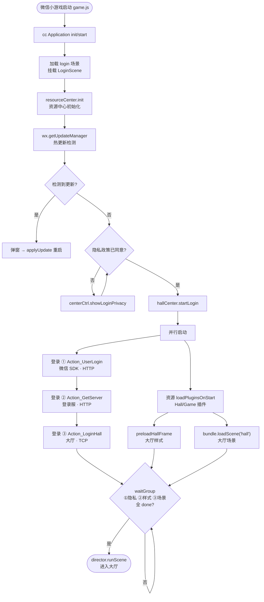
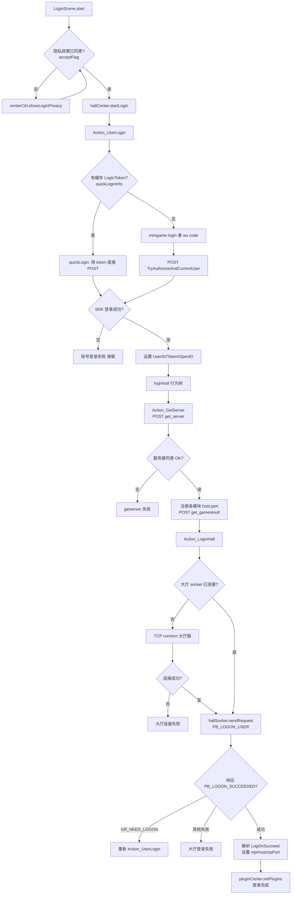
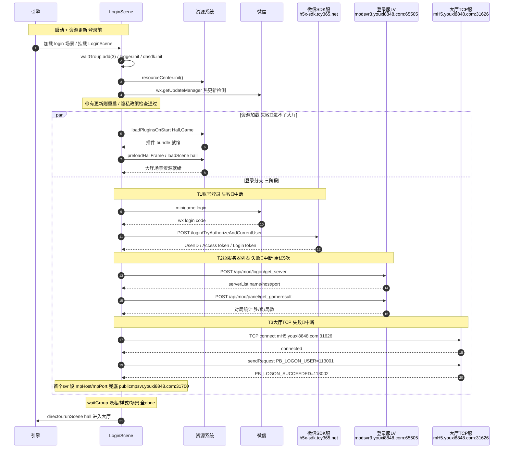

# 游戏登录流程（cocos-client/login-flow.md）

> 登录专项详解（含 Mermaid 流程图 / 时序图 + 登录相关域名 + 协议号）。
> 完整「启动 → 登录 → 大厅 → 进桌」概览见 `startup-flow.md`；本文深入登录环节。
> 故障影响分级（🔴/🟡/🟢）与完整 API 地址见 `login-api-sequence.md`；本文时序图中的 🔴/🟡/🟢 为视觉提示，详解以该文档为准。
>
> 来源：`game/template/components/loginscene.ts`、`game/template/hall/hallcenter.ts`、`game/mcagent/btree/action/action_userlogin.ts`、`game/platform/login/wx/index.ts`、`game/template/hall/btree/action/action_getserver.ts`、`game/template/hall/btree/action/action_loginhall.ts`、`game/core/network/http/HttpRequestPB.ts`、`game/mcagent/hslutils.ts`、`game/template/hall/HallReqDef.ts`。
>
> **当前环境**：`MiniGameConfig.json` 的 `serverMode: 2` → `ServerMode.Test`（`Formal=0 / Preview=1 / Test=2`），域名走测试套。

## 1. 登录链路总览

登录由 `hallCenter.startLogin()`（`hallcenter.ts:1644`）驱动，分**三个阶段**，由行为树编排：

| 阶段 | 行为树动作 | 网络 | 产物 |
|------|-----------|------|------|
| ① 账号登录 | `Action_UserLogin` | HTTP（微信 SDK 服） | UserID / AccessToken / LoginToken |
| ② 拉服务器列表 | `Action_GetServer` | HTTP（登录服 LV） | serverList（各模块 host:port）+ 对局统计 |
| ③ 大厅登录 | `Action_LoginHall` | TCP（大厅服） | 银两 / 等级 / 游戏服地址 |

> 三阶段全成功才算登录完成（`action_getserver.ts:176`：`userlogin → halllogin → getserver`）。任一失败 → `centerCtrl.hideConnecting()` + 错误弹窗。

### 1.1 启动 / 资源更新 / 资源加载 vs 登录（先后关系）

| 环节 | 相对登录 | 触发点（`loginscene.ts`） |
|------|---------|--------------------------|
| **app 启动** | 登录**前**（最先） | `game.js` → cc `Application.init/start` → 加载首场景 `login` → `director.EVENT_BEFORE_SCENE_LAUNCH` 挂 `LoginScene` |
| **资源更新**（微信热更新） | 登录**前** | `start()` 内 `wx.getUpdateManager().onCheckForUpdate()`，在 `startLogin()` **之前**注册；有更新→弹窗→`applyUpdate()` 重启 |
| `resourceCenter.init()` | 登录**前** | `start()` 第一步 |
| `loadPluginsOnStart([Hall,Game])` | 与登录**并行** | `start()` 内，紧接 `startLogin()` 之后；加载插件 bundle 代码 |
| `bundle.loadScene('hall')` + `preloadHallFrame()` | 与登录**并行** | 大厅场景资源 / 样式预载 |
| **登录**（三阶段） | 资源更新之后启动 | `hallCenter.startLogin()` |
| **切场景进大厅** | 登录完成 **且** 资源加载完成之后 | `waitGroup` 全 done → `checkEnterScene` → `director.runScene(hall)` |

**关键：登录与大厅场景资源加载是并行关系，不是串行。** `waitGroup.add(3)`（`onLoad`）协调 3 个并行任务，全 done 才切场景：

1. ① **授权隐私政策** → `startLogin()` 时 `done`
2. ② **预载大厅样式** `preloadHallFrame()` → Game 插件加载完后 `done`
3. ③ **载入大厅场景** `loadHallScene()` → `bundle.loadScene('hall')` 完成后 `done`

> 完整流程图与时序图（含启动 / 资源更新 / 资源加载 / 登录全链路）见 §2。

## 2. 流程图

### 2.1 启动 → 资源更新 → 资源加载 → 登录 → 进大厅（整体流程）



### 2.2 登录决策细节



### 2.3 启动 → 资源更新 → 资源加载 → 登录 → 进大厅（完整时序）

> 下图以**正式环境**（`serverMode=0`）域名为例；测试环境域名见 §4。



## 3. 三阶段详解

### 3.1 阶段① — 微信 SDK 登录（`Action_UserLogin` + `platform/login/wx/index.ts`）

```
union_login() → wx_login(canQuickLogin)
  ├── 快速登录 quickLogin(): 用 LocalCache 缓存的 LoginToken 直接 POST 同一 URL
  └── 全新登录:
        minigame.login() → 拿 wx code               ← 微信原生 API
        POST {SdkBase}/login/TryAuthorizeAndCurrentUser
          body: { AppId, Code: wx_login_code, PartnerAppID, UserType:11,
                  StatExtInfo{RecommenderID,ChannelID,AppCode,PromoteCode,Sys},
                  OAuthInfo{...}, Version, LoginSource{GameID,GameCode,AppID,...} }
          header: { GsClientData }
          ← { UserID, UserName, AccessToken, LoginToken,
              ThirdIdentity{OpenID,UnionID,HeadUrl,NickName} }
        setLoginCookie(Set-Cookie)
        缓存 quickLoginInfo{userName, userPassword=LoginToken, hardID, wifiID, openID}
```

成功回调 `onH5LoginCallback` 设置 userid / token / openid 等，`getAttrresult()` 延迟 2s 上报归因（注册 / 登录 / 回流）。首次登录另触发 `CheckMsgSecAuthAccessToken`（微信内容安全 2.0，POST `{SdkBase}/Third/CheckMsgSecAuthAccessToken`）。

失败处理：账号注销中（message 含"注销"）→ `INTERRUPT` + 客服弹窗；其他 → `FAILURE` + 错误信息。

### 3.2 阶段② — 拉服务器列表（`Action_GetServer`，HTTP）

```
POST {LoginSvr}/api/mod(logon)/get_server        ← HallPB.GetServerReq
  ← HallPB.GetServerResp { list:[{name,host,port,maxversion}], time }
  遍历 list (跳过 maxversion < TemplateVersion 的):
       HttpRequestPB.setHostInfo(name, host, port)
            内部存 httpPort = port + 1
  若返回 loginSvr ≠ 请求的 → 切换登录服，重试 login(count+1)  (最多 5 次)
  缓存 LogonAddress_{serverMode} 供下次启动
POST {LoginSvr}/api/mod(panel)/get_gameresult    ← HallPB.GetGameResultReq
  ← { gameresult{total_bout, total_win, total_loss, total_standoff}, subgameresults }
```

`{LoginSvr}` 由 `HttpRequestPB.getLoginSvr()` 决定（见 §4.2）。

> ⚠️ 源码 URL 写成硬编码 `http://192.168.1.26/api/mod(logon)/get_server`，但 `postWithUrl` 对 `module=="logon"` 强制用 `getLoginSvr()` **替换** host（`HttpRequestPB.ts:101-107`）；Test 模式还会把 `192.168.1.26` → `192.168.1.125`（`HttpRequestPB.ts:77`）。

### 3.3 阶段③ — 大厅 TCP 登录（`Action_LoginHall`）

```
1. TCP 连接大厅 socket:
   hallSocket.connect() → super.connect(Hsl.getHallSvr().szServerIP, nPort, ...)
       已连过(有 host) → reconnect()；否则 connect()
   连接成功 → onHallConnectOK → loginUser()
   心跳: MR_REQUEST_PULSE (30003), 60s/次, 3 次超时断开(大厅场景自动重连)

2. 发送登录请求 (TCP + protobuf):
   hallSocket.sendRequest(HallReqDef.PB_LOGON_USER /*113001*/, "HallPB.LogOnUser", params)
     params: { userid, username, password, hardid, volumeid, machineid,
               gameid, gamever, channelid, gamecode, logonflags, pkgtype,
               agentgroupid, recommenderid, hallbuildno, ... }
   ← 响应:
       HallReqDef.PB_LOGON_SUCCEEDED (113002) → 解析 HallPB.LogOnSucceed
       HallReqDef.GR_NEED_LOGON (60039) → isQuickLogin 时回退重新 Action_UserLogin
       其他 → FAILURE

3. 解析 LogOnSucceed:
   { userid, uniqueid, usertype, registergroup, createday, createhour,
     usergameinfo{deposit, playerlevel, score, experience, win, loss, bout, ...},
     svrs:[{ip, www, port, type}] }
   → Socket.mpHost = svr.ip || svr.www     (小游戏优先 type==1)
   → Socket.mpPort = svr.port
   → 正式环境无 svrs 时兜底: publicmpsvr.youxi8848.com : 31700
   → dataCenter 派发 InitLoginData / InitRegisterTimeStamp
```

`logonflags` 组合：`FLAG_LOGON_HANDPHONE | FLAG_LOGON_USEDSDK`（Test 再加 `FLAG_LOGON_INTER`，PC 模拟器加 `FLAG_LOGON_SIMULATOR`）。

PC 平台额外前置：HTTP `https://passport.tcy365.com/LoginFromSign.aspx`（Test: `http://passport.tcy365.org:1505/...`）换 AccessToken，再走 `loginUserNormal(isPCLogin=true)`（用 accessToken + uniqueid 而非 password）。**小游戏不走此分支**。

## 4. 登录相关域名

### 4.1 微信 SDK 服（`platform/login/wx/index.ts`）

| 模式 | BaseUrl | 用途 |
|------|---------|------|
| Formal (0) | `https://h5x-sdk.tcy365.net` | 账号登录 |
| Preview (1) | `https://sdk1.tcy365.net` | 账号登录 |
| **Test (2) ← 当前** | `https://testdemosdk.tcy365.net` | 账号登录 |

API：
- `POST {BaseUrl}/login/TryAuthorizeAndCurrentUser` — 登录 / 快速登录
- `POST {BaseUrl}/Third/CheckMsgSecAuthAccessToken` — 微信内容安全 2.0（首次登录）

### 4.2 登录服 LV（`HttpRequestPB.ts`）

`getLoginSvr()` 优先级：服务器下发 `_hosts["logon"]` > 缓存 `LogonAddress_{mode}` > 默认值。

| 模式 | 默认登录服 |
|------|-----------|
| Formal (0) | `https://modsvr3.youxi8848.com:65505` |
| Preview (1) | `http://47.114.124.159:65505` |
| **Test (2) ← 当前** | `http://192.168.1.125:65505` |

API（`{scheme}://{host}:{port}/api/mod({module})/{action}`）：
- `/api/mod(logon)/get_server` — 拉服务器列表
- `/api/mod(panel)/get_gameresult` — 对局统计

特性：protobuf 序列化、AES-CBC 加密（`Config.encrypted` 时 key = userUniqueId 前 16 字节）、`HTTP = TCP + 1`、正式 + 小游戏强制 HTTPS。

### 4.3 大厅 TCP 服（`Hsl.getHallSvr()`，`hslutils.ts`）

| 模式 | 地址 | 端口 |
|------|------|------|
| Formal (0) | `mH5.youxi8848.com` | **31626** |
| Preview (1) | `m888.youxi8848.com` | 31626 |
| **Test (2) ← 当前** | `h5gametest.tcy365.com` | 31626 |
| JSB 原生 | `jsb.hslUtils.getHallSvrIp()` | `getHallSvrPort() \|\| 31626` |
| 原生调试 | `192.168.1.222` | 31626 |

### 4.4 PC 签名换 Token（仅 PC 模拟器）

| 模式 | 地址 |
|------|------|
| Formal | `https://passport.tcy365.com/LoginFromSign.aspx` |
| Test | `http://passport.tcy365.org:1505/LoginFromSign.aspx` |

## 5. 登录相关协议号（TCP）

> 全量协议号表见 `startup-flow.md` §8；此处只列登录链路涉及的。

### 5.1 大厅登录协议号（`game/template/hall/HallReqDef.ts`）

| 常量 | 值 | 方向 | 含义 |
|------|----|------|------|
| `PB_LOGON_USER` | **113001** | C → S | **PB 登录请求**（当前用，`HallPB.LogOnUser`） |
| `PB_LOGON_SUCCEEDED` | **113002** | S → C | **PB 登录成功响应**（`HallPB.LogOnSucceed`） |
| `MR_LOGON_USER_V2` | 30102 | C → S | 登录大厅 V2（旧） |
| `GR_NEED_LOGON` | 60039 (`50000+10039`) | S → C | 需重新登录（触发回退 `Action_UserLogin`） |
| `MR_REQUEST_PULSE` | 30003 | C → S | 大厅心跳（带回应，60s/次） |
| `KICKEDOFF_LOGONAGAIN` | 80103 (`50000+30103`) | S → C | 重复登录踢人 |
| `KICKEDOFF_BYADMIN` | 80104 (`50000+30104`) | S → C | 管理员踢人 |
| `GR_KICKEDOFF_FORBIDTWOHALL` | 80105 (`50000+30105`) | S → C | 设备顶号 |
| `GET_SERVERS` | 30010 | C → S | 获取大厅 IP（TCP 旧通道，当前登录走 HTTP `get_server`） |
| `GET_SERVERS_OK` | 80691 | S → C | 获取大厅 IP 回应 |

### 5.2 登录涉及的 protobuf 消息（`HallPBStruct.ts`）

| 消息名 | 用途 |
|--------|------|
| `HallPB.LogOnUser` | 登录请求体（`PB_LOGON_USER` 载荷） |
| `HallPB.LogOnSucceed` | 登录成功响应体（`PB_LOGON_SUCCEEDED` 载荷） |
| `HallPB.GetServerReq` / `HallPB.GetServerResp` | HTTP `get_server` 请求/响应 |
| `HallPB.GetGameResultReq` / `HallPB.GetGameResultResp` | HTTP `get_gameresult` 请求/响应 |
| `HallPB.ErrorInfo` / `HallPB.ErrorInfoOnly` | 错误信息（HTTP 202 响应解析） |

## 6. 登录失败 / 重连

- **账号登录失败**（`Action_UserLogin` FAILURE）：网络不可用 → "当前网络不可用"；否则 → `账号登录失败【${message}】`。
- **getserver 失败**：若用缓存地址失败 → 清缓存 + 回退默认登录服重试；否则 `loginhall` 行为树 FAILURE。
- **大厅 TCP 连接失败**（`onHallConnectError`）：`loginhall` FAILURE → `ChangeNetWorkStatus(false)` + `LoginCompleted` 内部事件 + `hallSocket.close()`。
- **大厅登录返回 `GR_NEED_LOGON`**：仅 `isQuickLogin` 时回退重新 `Action_UserLogin` 后重试 `loginUserNormal`。
- **大厅断线**（`onHallDisconnected`）：`Action_CheckNetStatus` 检测 + 重连（大厅场景自动重连，游戏中不因大厅断开重连）。
- **心跳超时**：`MR_REQUEST_PULSE` 连续 3 次无响应 → `closeSocket()` + 大厅场景 `checkNetworkStatus` 重连。

## 7. 关键标识（`MiniGameConfig.json`，登录用）

```
gameID: 53, gameCode: "zgde"
channelID: "1000001063", promoterId: "100000"
partnerAppId: "wxbe992d3f39f3f94c"     ← 微信小游戏 appId（登录 AppId 来源）
ctAppId: "ctca9c7d3bd872d0f7"          ← 同城游框架 appId
userActionSetId: 1215087537            ← dnsdk 归因上报
serverMode: 2  (Test)                  ← 决定登录域名走向
```

## 8. 注意事项

1. **当前测试环境**：`serverMode=2`，登录走 SDK `testdemosdk.tcy365.net` + LV `192.168.1.125:65505` + 大厅 `h5gametest.tcy365.com:31626`。**正式发布前需改 `0`（Formal）**。
2. **开发遗留硬编码**：`action_getserver.ts` 的 `192.168.1.26` 是占位，运行时被 `getLoginSvr()` 替换，无需手动改。
3. **快速登录**：微信小游戏缓存 `quickLoginInfo`（含 LoginToken），下次启动优先走 `quickLogin` 跳过 `minigame.login`；失败回退全新登录。
4. **登录与插件初始化的时序**：`getserver` 成功后即 `pluginCenter.initPlugins()`（`action_getserver.ts:180`），不等大厅登录；大厅登录成功后再次 `initPlugins()`（幂等）。
